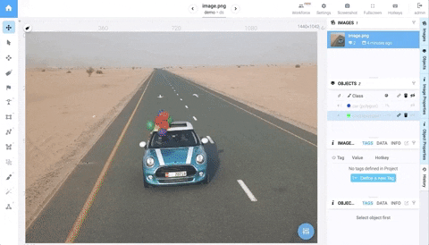
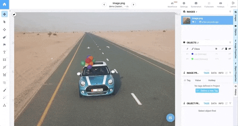
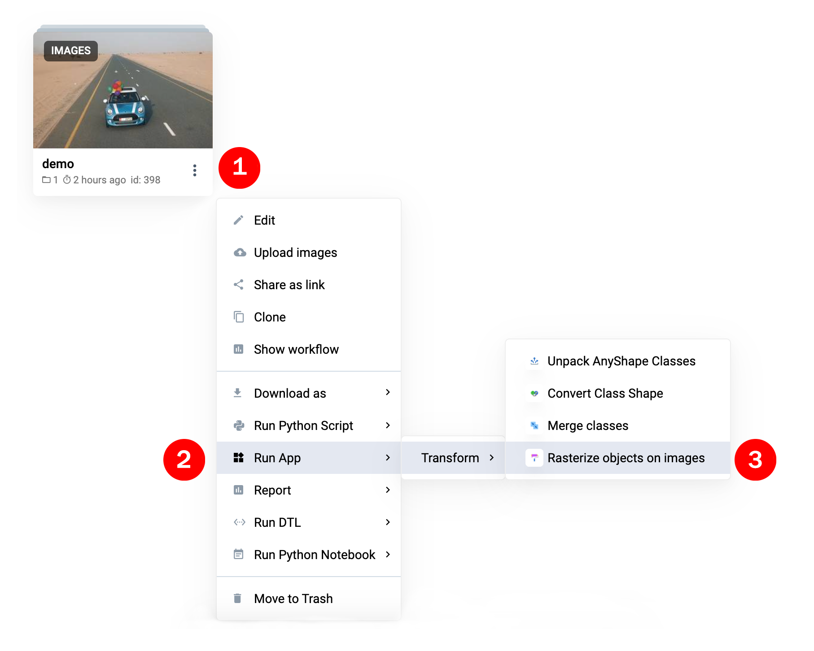
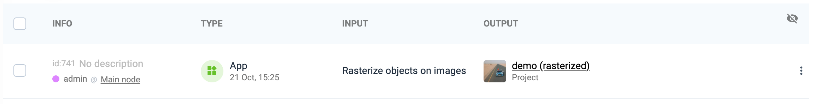

 

# Rasterize objects on images
  

  <a href="#Overview">Overview</a> •
  <a href="#Specification">Specification</a> •
  <a href="#How-To-Run">How To Run</a>

 

## Overview 
During labeling objects are treated as layers. Objects order matters and defines final visualization. For example, objects rasterization is needed to train semantic segmentation model (every pixel on the image have to belong to a single class). 

Let's see the example below. First labeled object is road, second object is car. We labeled them separately. Now some image pixels (car) belong to two objects simultaneously. 

How mo make a hole in the road object? 

**Option 1: during labeling**. Drawbacks: 
- It requires more clicks (car will be labeled twiсe - as a hole in the road and as ar itself) - even with a specially designed labeling tools it is time consuming. 
- It is hard to modify objects. If the car is labeled wrong, we have to modify both the car and the hole in the road. Therefore we make more clicks and spend more time.
- Sometimes it is impossible because annotation requirements may change over time. For example: at the beginning we labeled only `road` surfaces and then requirements changed - new class `car` have to be labeled too.   

**Option 2: rasterization approach**. In labeling inteface we label objects as layers and keep specific order with intersections. Before exporting labeled data we rasterize annotations. As a result we use rasterized data to train model. This method does not have the disadvantages from `Option 1` described above. **Some notes**: such approach is used by many profeccional labeler and in academia. For example, objects in [Cityscapes Dataset](https://www.cityscapes-dataset.com/) were labeled in specific order with intersection and the automatically postprocessed like this app does.  

So the result after rasterization will be the following:

## Specification

- Result project name = original name + "(rasterized)" suffix
- Classes with shapes "rectangle", "polygon", "bitmap" and "any shape" will be converted to shape bitmap, other classes remain the same
- All objects will be rasterized without intersections (i.e. one pixel will belong to only one object)
- Classes with other shapes ("polyline", "point", etc) and their objects will be copied to result project without modification
- If input data is labeled for instance segmentation, resulting project also will contain corrected instance segmentations (one pixel - one object). 

## How To Run

### Step 1: Run from context menu of project

Go to "Context Menu" (images project) -> "Run App" -> "Transform" -> "Rasterize objects on images"

### Step 2:  Waiting until the task finishes

Once app is started, new task appear in workspace tasks. Monitor progress from "Tasks" list.

